# Entity relationship diagrams

Generated from the live catalogue rather than drawn by hand, so the cardinalities are
the foreign keys that actually exist. Forty-five tables do not fit in one readable
diagram, so the schema is drawn twice at different scopes: the operational entities
first, with the reference tables they point at collapsed to their code column, then the
reference tables on their own.

Cardinality is read off the catalogue: a mandatory foreign key is `||` on the parent
side, a nullable one is `|o`, and the child side is `o{` unless a unique constraint
makes it `o|`.

## Core

```mermaid
erDiagram
    customers {
        bigint customer_id PK
        varchar customer_reference UK
    }
    customer_addresses {
        bigint customer_address_id PK
        bigint customer_id FK
        char country_code FK
    }
    accounts {
        bigint account_id PK
        varchar account_number UK
        varchar account_type_code FK
        char currency_code FK
        char country_code FK
        varchar account_status_code FK
    }
    account_holders {
        bigint account_holder_id PK
        bigint account_id FK
        bigint customer_id FK
        varchar holder_role_code FK
    }
    cards {
        bigint card_id PK
        char card_reference UK
        bigint account_id FK
        varchar card_product_code FK
    }
    merchants {
        bigint merchant_id PK
        varchar merchant_reference UK
        char mcc_code FK
        char country_code FK
    }
    agent_locations {
        bigint agent_location_id PK
        varchar agent_location_reference UK
        char country_code FK
    }
    transactions {
        bigint transaction_id PK
        varchar transaction_reference UK
        bigint account_id FK
        bigint card_id FK "nullable"
        bigint merchant_id FK "nullable"
        bigint agent_location_id FK "nullable"
        bigint reversal_of_transaction_id FK "nullable"
        varchar transaction_type_code FK
        varchar channel_code FK
        varchar transaction_status_code FK
        char transaction_currency_code FK
    }
    payments {
        bigint payment_id PK
        varchar payment_reference UK
        bigint account_id FK
        varchar payment_type_code FK
        varchar payment_scheme_code FK
        varchar payment_status_code FK
        char payment_currency_code FK
        char counterparty_country_code FK "nullable"
    }
    loan_applications {
        bigint loan_application_id PK
        varchar application_reference UK
        bigint customer_id FK
        varchar loan_product_code FK
        varchar loan_application_status_code FK
        varchar risk_band_code FK "nullable"
        varchar decision_reason_code FK "nullable"
        char application_currency_code FK
    }
    loans {
        bigint loan_id PK
        varchar loan_reference UK
        bigint loan_application_id FK
        bigint customer_id FK
        varchar loan_product_code FK
        varchar loan_status_code FK
        char loan_currency_code FK
    }
    loan_installments {
        bigint loan_installment_id PK
        bigint loan_id FK
        smallint installment_number UK
        char installment_currency_code FK
    }
    gl_transactions {
        bigint gl_transaction_id PK
        varchar gl_transaction_reference UK
        date posting_date
        varchar source_entity_code FK "nullable"
        bigint source_entity_id "nullable, polymorphic, no FK"
    }
    gl_entries {
        bigint gl_entry_id PK
        bigint gl_transaction_id FK
        date posting_date FK
        varchar gl_account_code FK
        char entry_side_code FK
        char entry_currency_code FK
        bigint account_id FK "nullable"
    }
    fraud_alerts {
        bigint fraud_alert_id PK
        varchar alert_reference UK
        bigint transaction_id FK
        bigint customer_id FK
        varchar fraud_rule_code FK
        varchar fraud_disposition_code FK
    }
    login_sessions {
        bigint login_session_id PK
        varchar session_reference UK
        bigint customer_id FK
        varchar channel_code FK
        varchar login_outcome_code FK
        char ip_country_code FK "nullable"
    }
    ref_account_statuses {
        varchar code PK
    }
    ref_account_types {
        varchar code PK
    }
    ref_card_products {
        varchar code PK
    }
    ref_channels {
        varchar code PK
    }
    ref_countries {
        varchar code PK
    }
    ref_currencies {
        varchar code PK
    }
    ref_decision_reasons {
        varchar code PK
    }
    ref_entry_sides {
        varchar code PK
    }
    ref_fraud_dispositions {
        varchar code PK
    }
    ref_fraud_rules {
        varchar code PK
    }
    ref_gl_accounts {
        varchar code PK
    }
    ref_holder_roles {
        varchar code PK
    }
    ref_loan_application_statuses {
        varchar code PK
    }
    ref_loan_products {
        varchar code PK
    }
    ref_loan_statuses {
        varchar code PK
    }
    ref_login_outcomes {
        varchar code PK
    }
    ref_mcc_codes {
        varchar code PK
    }
    ref_payment_schemes {
        varchar code PK
    }
    ref_gl_source_entities {
        varchar code PK
    }
    ref_payment_statuses {
        varchar code PK
    }
    ref_payment_types {
        varchar code PK
    }
    ref_risk_bands {
        varchar code PK
    }
    ref_transaction_statuses {
        varchar code PK
    }
    ref_transaction_types {
        varchar code PK
    }
    accounts ||--o{ account_holders : account_id
    customers ||--o{ account_holders : customer_id
    ref_holder_roles ||--o{ account_holders : holder_role_code
    ref_account_statuses ||--o{ accounts : account_status_code
    ref_account_types ||--o{ accounts : account_type_code
    ref_countries ||--o{ accounts : country_code
    ref_currencies ||--o{ accounts : currency_code
    ref_countries ||--o{ agent_locations : country_code
    accounts ||--o{ cards : account_id
    ref_card_products ||--o{ cards : card_product_code
    ref_countries ||--o{ customer_addresses : country_code
    customers ||--o{ customer_addresses : customer_id
    ref_countries ||--o{ customers : residence_country_code
    ref_risk_bands |o--o{ customers : risk_band_code
    customers ||--o{ fraud_alerts : customer_id
    ref_fraud_dispositions ||--o{ fraud_alerts : fraud_disposition_code
    ref_fraud_rules ||--o{ fraud_alerts : fraud_rule_code
    transactions ||--o{ fraud_alerts : transaction_id
    accounts |o--o{ gl_entries : account_id
    ref_currencies ||--o{ gl_entries : entry_currency_code
    ref_entry_sides ||--o{ gl_entries : entry_side_code
    ref_gl_accounts ||--o{ gl_entries : gl_account_code
    gl_transactions ||--o{ gl_entries : gl_transaction_id
    gl_transactions ||--o{ gl_entries : gl_transaction_id_posting_date
    ref_currencies ||--o{ loan_applications : application_currency_code
    customers ||--o{ loan_applications : customer_id
    ref_decision_reasons |o--o{ loan_applications : decision_reason_code
    ref_loan_application_statuses ||--o{ loan_applications : loan_application_status_code
    ref_loan_products ||--o{ loan_applications : loan_product_code
    ref_risk_bands |o--o{ loan_applications : risk_band_code
    ref_currencies ||--o{ loan_installments : installment_currency_code
    loans ||--o{ loan_installments : loan_id
    customers ||--o{ loans : customer_id
    loan_applications ||--o{ loans : loan_application_id
    ref_currencies ||--o{ loans : loan_currency_code
    ref_loan_products ||--o{ loans : loan_product_code
    ref_loan_statuses ||--o{ loans : loan_status_code
    ref_channels ||--o{ login_sessions : channel_code
    customers ||--o{ login_sessions : customer_id
    ref_countries |o--o{ login_sessions : ip_country_code
    ref_login_outcomes ||--o{ login_sessions : login_outcome_code
    ref_countries ||--o{ merchants : country_code
    ref_mcc_codes ||--o{ merchants : mcc_code
    accounts ||--o{ payments : account_id
    ref_countries |o--o{ payments : counterparty_country_code
    ref_currencies ||--o{ payments : payment_currency_code
    ref_payment_schemes ||--o{ payments : payment_scheme_code
    ref_payment_statuses ||--o{ payments : payment_status_code
    ref_gl_source_entities ||--o{ gl_transactions : source_entity_code
    ref_payment_types ||--o{ payments : payment_type_code
    accounts ||--o{ transactions : account_id
    agent_locations |o--o{ transactions : agent_location_id
    cards |o--o{ transactions : card_id
    ref_channels ||--o{ transactions : channel_code
    merchants |o--o{ transactions : merchant_id
    transactions |o--o{ transactions : reversal_of_transaction_id
    ref_currencies ||--o{ transactions : transaction_currency_code
    ref_transaction_statuses ||--o{ transactions : transaction_status_code
    ref_transaction_types ||--o{ transactions : transaction_type_code
```

## Reference and platform

```mermaid
erDiagram
    ref_account_statuses {
        varchar code PK
    }
    ref_account_types {
        varchar code PK
    }
    ref_card_product_classes {
        varchar code PK
    }
    ref_card_products {
        varchar code PK
    }
    ref_channels {
        varchar code PK
    }
    ref_countries {
        varchar code PK
    }
    ref_currencies {
        varchar code PK
    }
    ref_decision_reasons {
        varchar code PK
    }
    ref_entry_sides {
        varchar code PK
    }
    ref_fraud_dispositions {
        varchar code PK
    }
    ref_fraud_rules {
        varchar code PK
    }
    ref_gl_account_types {
        varchar code PK
    }
    ref_gl_accounts {
        varchar code PK
    }
    ref_gl_source_entities {
        varchar code PK
    }
    ref_holder_roles {
        varchar code PK
    }
    ref_interchange_rates {
        varchar code PK
    }
    ref_loan_application_statuses {
        varchar code PK
    }
    ref_loan_products {
        varchar code PK
    }
    ref_loan_statuses {
        varchar code PK
    }
    ref_login_outcomes {
        varchar code PK
    }
    ref_mcc_bands {
        varchar code PK
    }
    ref_mcc_codes {
        varchar code PK
    }
    ref_payment_schemes {
        varchar code PK
    }
    ref_payment_statuses {
        varchar code PK
    }
    ref_payment_types {
        varchar code PK
    }
    ref_regions {
        varchar code PK
    }
    ref_risk_bands {
        varchar code PK
    }
    ref_transaction_statuses {
        varchar code PK
    }
    ref_transaction_types {
        varchar code PK
    }
    platform_column_classifications {
        varchar schema_name PK
        varchar table_name PK
        varchar column_name PK
    }
    ref_card_product_classes ||--o{ ref_card_products : product_class_code
    ref_regions ||--o{ ref_countries : region_code
    ref_entry_sides ||--o{ ref_gl_account_types : normal_side_code
    ref_gl_account_types ||--o{ ref_gl_accounts : gl_account_type_code
    ref_card_product_classes ||--o{ ref_interchange_rates : card_product_class_code
    ref_mcc_bands ||--o{ ref_interchange_rates : mcc_band_code
    ref_regions ||--o{ ref_interchange_rates : merchant_region_code
    ref_mcc_bands ||--o{ ref_mcc_codes : band_code
```

`platform_column_classifications` has no foreign keys. It names columns in the other
two schemas as text, because a foreign key to the system catalogue is not something
Postgres offers; the relationship is enforced by `make schema-check` in both
directions instead.
